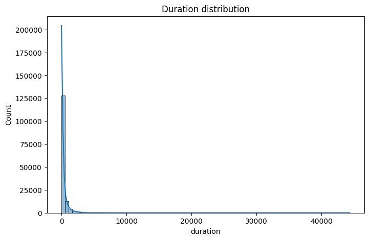
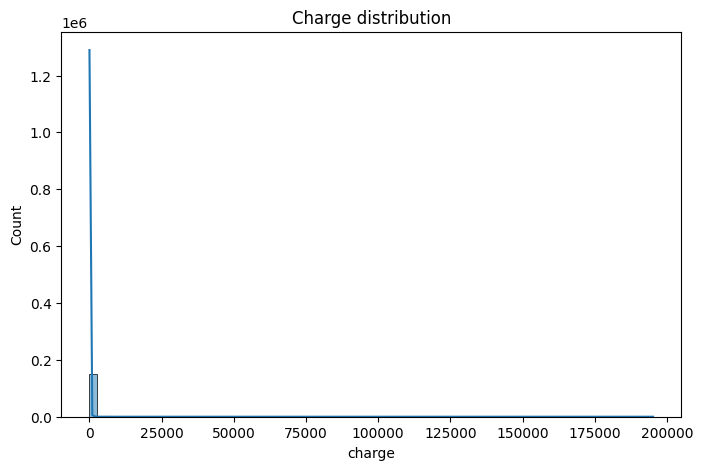
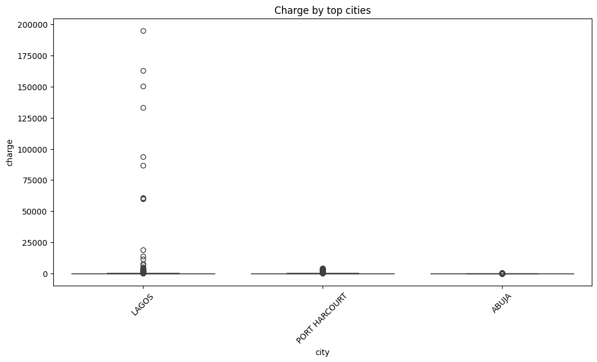
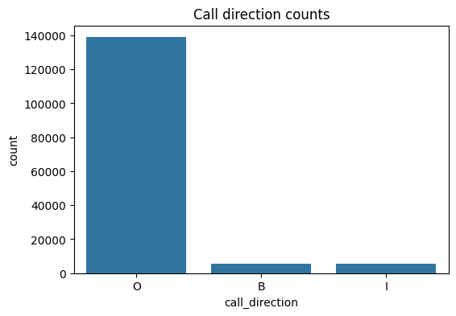
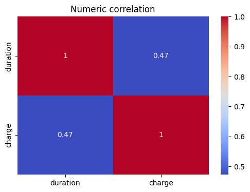
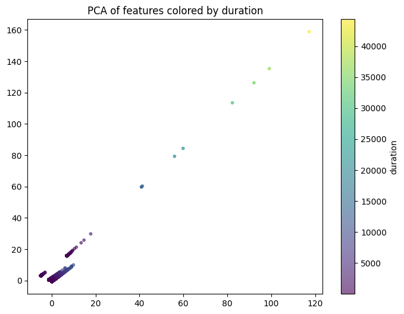

# ProjectRBSN — Anomaly Detection for CDRs

This repository contains scripts to train/run anomaly detection on call detail records (CDRs) and to run predictions on new data.

**Files**
- `anomaly_detection.py`: training and visualization script that prepares data, runs IsolationForest, LOF and OneClassSVM, and saves model/preprocessing artifacts.
- `predict_new_data.py`: utility to load saved model/scaler/label-encoders and predict anomalies on new CSV files (adds `is_anomaly` and `anomaly_label`).
- `January_masked_sample.csv`: example dataset used for training.
- `new_df.csv`: example new data used for prediction.
- `best_iso_forest_model.pkl`, `scaler.pkl`, `label_encoders.pkl`: saved artifacts produced by `anomaly_detection.py`.
- `predictions.csv`: example output produced by `predict_new_data.predict_anomalies()`.

**Requirements**
- Python 3.8+
- pandas, numpy, scikit-learn, matplotlib, seaborn, joblib

Install dependencies:
```bash
python -m pip install pandas numpy scikit-learn matplotlib seaborn joblib
```

**Usage — training / exploring**
1. Edit `anomaly_detection.py` paths if needed (default path uses `C:/Users/HP/Downloads/ProjectRBSN/January_masked_sample.csv`).
2. Run training + visualization:
```bash
python anomaly_detection.py
```
Outputs:
- `anomaly_comparison_local.png` — PCA scatterplots of model labels.
- `best_iso_forest_model.pkl`, `scaler.pkl`, `label_encoders.pkl` — artifacts saved for later predictions.

**Usage — predict on new data**
Use the helper in `predict_new_data.py` to run predictions and optionally save results to CSV.

From Python code:
```python
from predict_new_data import predict_anomalies
results = predict_anomalies('new_df.csv', model_dir='.', save_path='predictions.csv')
print(results[results['anomaly_label'] == 'Anomaly'])
```

Or from the shell:
```bash
python -c "from predict_new_data import predict_anomalies; predict_anomalies('new_df.csv', save_path='predictions.csv')"
```

**What the output contains**
- `is_anomaly`: model output (1 for inlier / -1 for outlier).
- `anomaly_label`: human-readable label (`Normal` / `Anomaly`).

**Notes & recommendations**
- File paths: use forward slashes (`/`) or raw strings on Windows to avoid escape issues.
- Encoding: `predict_new_data` maps unseen categorical values to the first class learned by the `LabelEncoder`. Consider updating this behavior if you prefer a different fallback (e.g., `Unknown` or retraining encoders).
- Missing columns in new data will raise an error — ensure `duration`, `charge`, `city`, `destination_type`, `call_direction` exist.
- If you re-run training with a different preprocessing pipeline, remember to update the saved artifacts and `model_dir` used by `predict_new_data`.

**Exploratory Data Analysis (EDA)**
The following EDA steps and visualizations are useful to understand the data distribution and spot obvious anomalies before modeling.

- Univariate distributions (histograms / KDE) for numeric features such as `duration` and `charge` to inspect skew and heavy tails.
- Boxplots per `city` or `destination_type` to find groups with outlying behavior.
- Countplots for categorical features (`city`, `destination_type`, `call_direction`) to check class imbalance.
- Correlation matrix / heatmap for numeric features to check multicollinearity before scaling.
- PCA scatterplot (2 components) colored by model labels — useful for visual comparison (one example output: `anomaly_comparison_local.png`).

Example snippets (run in a Python REPL or notebook):
```python
import pandas as pd
import seaborn as sns
import matplotlib.pyplot as plt

df = pd.read_csv('January_masked_sample.csv')
# histogram for duration
sns.histplot(df['duration'].astype(float), bins=80, kde=True)
plt.savefig('eda_duration_hist.png')

# boxplot of charge by city
plt.figure(figsize=(12,6))
sns.boxplot(data=df, x='city', y='charge')
plt.xticks(rotation=45)
plt.savefig('eda_charge_by_city.png')

# correlation heatmap
num_cols = ['duration','charge']
sns.heatmap(df[num_cols].corr(), annot=True)
plt.savefig('eda_corr.png')
```

Collect and save these figures in a folder (e.g., `eda/`) and include them in reports shared with teammates.

Preview of generated EDA figures (saved in `eda/`):














**Model Selection — Why IsolationForest was chosen**
We evaluated three approaches in `anomaly_detection.py`: `IsolationForest`, `LocalOutlierFactor` (LOF), and `OneClassSVM` (OCSVM). The final decision to use `IsolationForest` for production predictions was based on the following considerations:

- **Detection goal (global vs local outliers):** IsolationForest is designed for global outliers which match our operational goal of finding unusual call records across the dataset. LOF identifies local density anomalies which can be useful for fine-grained, neighborhood-level detection but is more sensitive to parameter `n_neighbors` and duplicate values.
- **Scalability and performance:** IsolationForest scales well to larger datasets and has faster fit/predict times than OCSVM. OCSVM can be computationally expensive and sensitive to kernel/hyperparameters (`gamma`, `nu`) on large, noisy CDR datasets.
- **Robustness to feature scaling:** After consistent scaling, IsolationForest performs reliably across numeric and encoded categorical features; OCSVM requires careful kernel tuning and LOF can be affected by duplicate rows (the implementation warns about duplicates).
- **Interpretability & control:** IsolationForest supports a `contamination` parameter (estimated fraction of outliers) which provided an easy, interpretable lever during experiments. This matched our operational requirement to set an expected anomaly budget (we used `contamination=0.01` in experiments).
- **Empirical evaluation:** We compared models by:
	- Visual inspection of PCA scatterplots colored by predicted labels (see `anomaly_comparison_local.png`).
	- Checking the number of flagged records and reviewing samples to validate that flagged records correspond to unusual durations/charges or unlikely category combinations.
	- Observing runtime/memory characteristics on the sample subset.

In short, IsolationForest offered the best trade-off between detection quality for global outliers, runtime performance, and operational control. LOF remains available in the repo for local-density checks and further experimentation; OCSVM can be revisited with smaller feature sets or different kernels if boundary-based detection is later required.

**Empirical Model Comparison**
We ran a side-by-side experiment across contamination rates (0.1%, 0.5%, 1%, 2%, 5%) on a 20,000-record sample. The results show:
- **Anomaly counts:** IsolationForest and LOF produce nearly identical counts across all contamination levels, while OneClassSVM consistently flags more records (e.g., 296 vs. 199 for IF at 1% contamination).
- **Agreement (Jaccard similarity):** Very low overlap between IF and LOF predictions (near 0), indicating they find fundamentally different sets of outliers. OneClassSVM overlaps more with IF as contamination increases (up to ~37% at 5%), but finds a distinct boundary-based set.
- **Visual patterns (PCA):** IsolationForest highlights isolated global outliers; LOF surfaces local density anomalies; OneClassSVM identifies boundary regions. The choice of IF aligns with our goal of detecting unusual call records across the population.

Embedded model-comparison figures (saved in `model_comparison/`):


**Troubleshooting**
- Unicode/escape errors when specifying Windows paths: use `C:/path/to/file.csv` or prefix with `r"C:\path\to\file.csv"`.
- `FileNotFoundError` when loading model artifacts: ensure the `.pkl` files are present in `model_dir` or pass the correct `model_dir` to `predict_anomalies()`.
- If LOF warns about duplicate values, increase `n_neighbors` in `anomaly_detection.py`.


